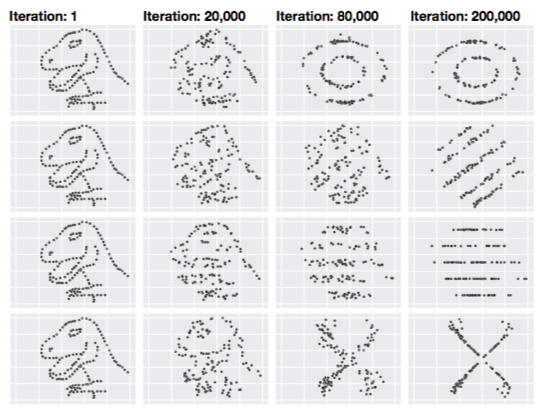

```{r setup, include=FALSE}
knitr::opts_chunk$set(echo = FALSE, message=FALSE, cache=TRUE)
library(tidyverse)
library(nullabor)
```

# Introduction and literature review {#ch:intro}

<!--
Problem statement
-->
The multiple regression model for cross-sectional data is still the most widely used vehicle for empirical analysis in economics and other social sciences [@IE17]. Detecting possible violations of the Gauss-Markov assumptions is crucial to interpret the data properly, especially in the early stage of analysis. Residuals are used to assess these assumptions. There are several distribution tests that are commonly used, but primarily residual plots are the main diagnostic tool and these rely on human evaluation. **ADD: sentence or two about Anscombe's quartet** The question that arises today is whether we can train a computer to read residual plots, particularly with a computer vision approach such as deep learning. 

<!--
Motivation based on Simchoni's blog post
-->
Motivation for the task is provided in a blog post by Giora Simchoni [@SIM18]. He has designed a deep learning model to test the significance of linear relationship between two variables for samples of size 50. The model reached over 93% accuracy on unseen test data. He also mentioned that the computer fails to pick up a strong non-linear relationship even though the Pearson'r is as high as -0.84 [@SIM18]. I think one can think of this as a disadvantage of the deep learning model, because it is not flexible compared to human vision, as Simchoni explained in his article. Since human can easily detect any relationship between the two variables, while the model can only tell linear relationship as trained. On the other hand, I think this is also an advantage of deep learning model, or visualization itself. If your purpose is to detect linear relationship exclusively, you do not want other types of relationships to mess up your decision, then this model does a really good job of ignoring noises, especially compared to conventional Pearson'r. Just as Anscombe’s Quartet demonstrated, totally different plots can give exactly the same statistics. Matejka and Fitzmaurice also did an interesting study on this issue. As shown in figure 1.1, each dataset has the same summary statistics to two decimal places: ($\bar{x}$=54.26, $\bar{y}$= 47.83, sdx = 16.76, sdy = 26.93, Pearson’s r = -0.06). Furthermore, if we want the model to distinguish not only linear relationship from no relationship, but also be able to tell what the relationship is, we need to adjust our design of training accordingly.

<!--
Visual inference literature explanation - framework for assessing detection of difference from a null
-->

<!--
Explain deep learning models 
-->

<!--
Scope of the experimental framework: non-linear relationship between dependent-independent variables 
-->
We will focus on testing two of the issues in one go by reading residual plots. More specifically, we want to distinguish non-linear relationship between dependent-independent variables and linear relationship but with heteroskedasticity from the classic linear model.

The residuals are the deviation from the observed and the predicted values according to the assumed model. If the assumptions about the validity of the model are valid, the residual plot (scatter plot between the residuals and the predicted values) will have a random distribution. Otherwise, it will have unexplained systematic pattern [@GF92].

Former studies have shown that human eyes are sensitive to such patterns. With proper manipulation, visualized plots can be used as test statistics. A simple but rigorous protocol that provides inferential validity is lineup, named after the 'police lineup' of criminal investigations. The protocol consists of generating 19 null plots (in general), inserting the plot of the real data in a random location among the null plots and asking the human viewer to single out one of the 20 plots as most different from the others [@HW10]. If the real plot is chosen, we reject the null hypothesis. Figure 1 is an example of lineup. Which plot do you think is the most different? If you choose one, you choose the plot of real data [@SIM18]. This protocol was proved to be valid and powerful therotically and also through human experiments, especially when the assumptions for doing conventional tests are violated [@MM13].

```{r image1, message=FALSE, fig.cap="Scatterplot lineup example: one plot is the data, the rest are generated from a null model assuming no relationship between the two variables. In this lineup it is easy to see that plot 1, which is the data plot, is different from the rest.", fig.height=6, fig.width=6}
lineup_data_mtcars <- lineup(null_permute("hp"), mtcars, pos = 1)

ggplot(lineup_data_mtcars, aes(disp, hp)) +
  geom_point() +
  #theme(axis.title.y=element_blank()) +
  facet_wrap(~ .sample)
```

Although visual statistical inference is promising for tackling many challenging issues in statistics, it is expensive and time consuming to render every single test with human experiment. In light of the deep learning neural network, we are now going to train the computers to read the residual plots for us. Hopefully, once we have a well-trained model, it only costs us a few seconds to do a visual test with high accuracy.

In his blog, Simchoni has designed a deep learning model to test the significance of linear relationship between two variables for samples of size 50. The model reached over 93% accuracy on unseen test data. He also mentioned that the computer fails to pick up a strong non-linear relationship even though the Pearson'r is as high as -0.84 [@SIM18]. I think one can think of this as a disadvantage of the deep learning model, because it is not flexible compared to human vision, as Simchoni explained in his article. Since human can easily detect any relationship between the two variables, while the model can only tell linear relationship as trained. On the other hand, I think this is also an advantage of deep learning model, or visualization itself. If your purpose is to detect linear relationship exclusively, you do not want other types of relationships to mess up your decision, then this model does a really good job of ignoring noises, especially compared to conventional Pearson'r. Just as Anscombe’s Quartet demonstrated, totally different plots can give exactly the same statistics. Matejka and Fitzmaurice also did an interesting study on this issue. As shown in figure 1.1, each dataset has the same summary statistics to two decimal places: ($\bar{x}$=54.26, $\bar{y}$= 47.83, sdx = 16.76, sdy = 26.93, Pearson’s r = -0.06). Furthermore, if we want the model to distinguish not only linear relationship from no relationship, but also be able to tell what the relationship is, we need to adjust our design of training accordingly.

{width=15cm}

This is also what we are trying to do here, given what Simchoni has done, we will extend his study further by augmenting the model to meet a broader purpose. Hopefully, it will shorten the distance between human vision and computer vision. Chapter 2 will talk about our model design in details. A lot of decisions have been made in that section. We will also explain the reasons for each decision. Chapter 3 is about the convolutional neural network and its performance based on our current data sets.


