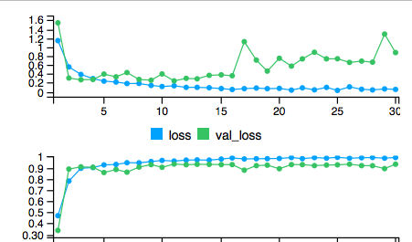

<!--
# Deep Learning Model {#ch:dlm}

## Model and Image {#sec:modelimage}

The model we use here is the convolutional neural networks, also known as convnets, a type of deep-learning model almost universally used in computer vision applications [@DLR18]. The code is almost the same with the one used on dogs-versus-cats classification problem as an example given in Chollet and Allaire's book. The only modification here is the change from binary classification to multiple classification. 
We set our images to have 150*150 pixels to fit into the structure of the model. Furthermore, we set the transparency of each scatter plot as 0.01, to help the computer "see" easier when sample size is large.

## Training Results {#sec:train}

For now, we have simulated 900 images of each group as our training set; 200 images of each group as the validation set; and 300 images of each group as the unseen test set. After 30 iterations, the accuracy of the training set has reached 99.25%, 93.3% for validation set, and 94% for test set. We will generate more images later on for training to improve the model's performance and render some comparison with human data.

{width=15cm}\
-->
# Software

- The thesis, code and data is available on the github repository [https://github.com/shuofan18/ETF5550](https://github.com/shuofan18/ETF5550)
- Software used to conduct this research is @R, @Tensorflow, @keras, @tidyverse

# Timeline

\begin{tabular}{lp{10cm}}
Date & Component \\\hline
Apr 27 & Deep learning model trained \\
May 4  & Classification of new residual plots with model and results summarised\\
May 18 & Comparison with Turk studies\\
May 24 & Refinements made, final summaries written\\
May 31 & Thesis finalised\\
\end{tabular}

