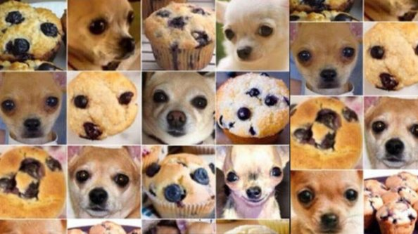

```{r setup, include=FALSE}
knitr::opts_chunk$set(echo = FALSE, message=FALSE, warning=FALSE, cache=TRUE, dev.args=list(bg=grey(0.9), pointsize=11))
```

## Goal

**Teach the computer to read residual plots**

A major component used to diagnose model fits is a plot of the residuals. Residual plots are used to assess:

- Gauss-Markov assumption
- Uncaptured (non-)linear components
- Heteroskedasticity
- Clumps of outliers 

## Why plots? 

```{r saurus, fig.height=2, fig.width=3.5, fig.align="center"}
library(tidyverse)
library(datasauRus)
ggplot(datasaurus_dozen, aes(x = x, y = y, colour = dataset)) +
  geom_point(size=0.5, alpha=0.5) +
  theme_void() +
  theme(legend.position = "none") +
  #theme(aspect.ratio = 1) +
  facet_wrap( ~ dataset, ncol = 5)
```

$E(x)=54.3, E(y)= 47.8, sd(x) = 16.8, sd(y) = 26.9, r = -0.06$

## Visual inference

```{r visinf}
library(nullabor)
library(broom)
x <- runif(100, -1, 1)
df <- tibble(x, y=2+3*x+x^2-0.5*x^3+rnorm(100)*0.3)
df_lm <- lm(y~x, data=df)
df_mod <- augment(df_lm, df)
ggplot(lineup(null_permute(".std.resid"), df_mod), aes(x=x, y=.std.resid)) + geom_point() + facet_wrap(~.sample)
```

## Visual inference

- Plot of data is a test statistic
- Type of plot determines null hypothesis, e.g. residuals vs fitted scatterplot would imply $H_o:$ no relationship, vs $H_a:$ some relationship
- Human visual system evaluates lineup of data plot in field of null plots
- If data plot is "identified" as different from null, $H_o$ is rejected
- Combining results from multiple observers enables $p$-value calculation

## Deep learning

- Computer vision has advanced substantially
- Computer vision underlying self-driving cars, robotics
- Computer vision is being build on deep learning models

## Aside: Volvo admits its self-driving cars are confused by kangaroos

[Volvo admits its self-driving cars are confused by kangaroos](https://www.theguardian.com/technology/2017/jul/01/volvo-admits-its-self-driving-cars-are-confused-by-kangaroos)

Volvo's self-driving car is unable to detect kangaroos because hopping confounds its systems, the Swedish carmaker says.

## Aside: Computers can't tell difference between blueberry muffins and chihuahuas



## Experiment

1. Simulate data from the different models
2. Fit a linear model to the data, extract standardized residuals and fitted values
3. Save residual plots as fixed-sized images
4. Train a deep learning classifier to recognise the departures from assumptions
5. Test the model's performance on new data and compute the accuracy

## Data simulation {#sec:simulation}

These factors are being controlled in the data simulation

- Type of relationship: none, linear, nonlinear or heteroskedasticity
- Explanatory variables: $X \sim N(0,3)$ and intercept $\beta_0=0$
- Sample size: randomly generated between 20-1500
- Image size: fixed `150x150`

## Type of relationship

```{r levels}
library(gridExtra)
x <- runif(100, -1, 1)
xx <- runif(100, 0, 1)
none <- rnorm(100)
linear <- 2*x - 5*xx + rnorm(100)*0.5
nonlin <- 5*x + x^2 + rnorm(100)*0.2
heter <- 2*x + (x+1)*rnorm(100)*0.5
df <- tibble(x, none, linear, nonlin, heter)
df_lm1 <- lm(none~x, data=df)
df_lm2 <- lm(linear~xx, data=df)
df_lm3 <- lm(nonlin~x, data=df)
df_lm4 <- lm(heter~x, data=df)
lm1 <- augment(df_lm1, df)
lm2 <- augment(df_lm2, df)
lm3 <- augment(df_lm3, df)
lm4 <- augment(df_lm4, df)
p1 <- ggplot(lm1, aes(x=x, y=.std.resid)) + geom_point() + ggtitle("None")
p2 <- ggplot(lm2, aes(x=x, y=.std.resid)) + geom_point() + ggtitle("Linear")
p3 <- ggplot(lm3, aes(x=x, y=.std.resid)) + geom_point() + ggtitle("Non-linear")
p4 <- ggplot(lm4, aes(x=x, y=.std.resid)) + geom_point() + ggtitle("Heteroskedastic")
grid.arrange(p1, p2, p3, p4, ncol=2)
```

## Simchoni's analysis

Explain Simchoni's experiment

## Comparison with human subject experiments

- Majumder et al (2013) conducted a large study to compare the performance of the lineup protocol, assessed by human evaluators, in comaprison to the classical test
- Experiment 2 examined $H_o: \beta_k=0$ vs $H_a: \beta_k\neq 0$ assessing the importance of including variable $k$ in the linear model, conducted with a $t$-test, and also lineup protocol
- 70 lineups of size 20 plots
- 351 evaluations by human subjects
-
- Trained deep learning model will be used to classify plots from this study. Accuracy will be compared with results by human subjects.

## Example lineup from experiment 2


## Timeline

\begin{tabular}{lp{10cm}}
Date & Component \\\hline
Apr 27 & Deep learning model trained \\
May 4  & Classification of new residual plots with model and results summarised\\
May 18 & Comparison with Turk studies\\
May 24 & Refinements made, final summaries written\\
May 31 & Thesis finalised\\
\end{tabular}

## Materials

- The thesis, code and data is available on the github repository [https://github.com/shuofan18/ETF5550](https://github.com/shuofan18/ETF5550)
- Software used to conduct this research is R, Tensorflow, keras, tidyverse
