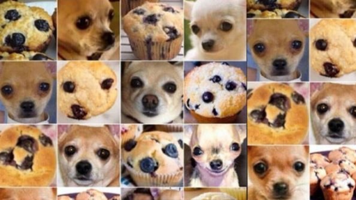

```{r setup, include=FALSE}
knitr::opts_chunk$set(echo = FALSE, message=FALSE, warning=FALSE, cache=TRUE, dev.args=list(bg=grey(0.9), pointsize=11))
```

## Reminder of the first presentation

**Teach the computer to read residual plots**

A major component used to diagnose model fits is a plot of the residuals. Residual plots are used to assess:

- Gauss-Markov assumption
- Heteroskedasticity
- Clumps of outliers 
- ...

## Why plots? 

```{r saurus, fig.height=2, fig.width=3.5, fig.align="center"}
library(tidyverse)
library(datasauRus)
ggplot(datasaurus_dozen, aes(x = x, y = y, colour = dataset)) +
  geom_point(size=0.5, alpha=0.5) +
  theme_void() +
  theme(legend.position = "none") +
  #theme(aspect.ratio = 1) +
  facet_wrap( ~ dataset, ncol = 5)
```

$E(x)=54.3, E(y)= 47.8, sd(x) = 16.8, sd(y) = 26.9, r = -0.06$

## Visual inference

```{r visinf}
library(nullabor)
library(broom)
set.seed(0414)
x <- runif(100, -1, 1)
df <- tibble(x, y=2+3*x+x^2-0.5*x^3+rnorm(100)*0.3)
df_lm <- lm(y~x, data=df)
df_mod <- augment(df_lm, df)
ggplot(lineup(null_permute(".std.resid"), df_mod), aes(x=x, y=.std.resid)) + geom_point() + facet_wrap(~.sample)
```

## Visual inference  

- Plot of data is a test statistic
- Type of plot determines null hypothesis, e.g. residuals vs fitted scatterplot would imply $H_o:$ no relationship, vs $H_a:$ some relationship
- Human visual system evaluates lineup of data plot in field of null plots
- If data plot is "identified" as different from null, $H_o$ is rejected
- Combining results from multiple observers enables $p$-value calculation

## Aside: Computers can't tell difference between blueberry muffins and chihuahuas  



## Amazon Turk study

- Majumder et al (2013) conducted a large study to compare the performance of the lineup protocol, assessed by human evaluators, in comaprison to the classical test
- Experiment 2 examined $H_o: \beta_k=0$ vs $H_a: \beta_k\neq 0$ assessing the importance of including variable $k$ in the linear model, conducted with a $t$-test, and also lineup protocol
- 70 lineups of size 20 plots
- 351 evaluations by human subjects
-
- Trained deep learning model will be used to classify plots from this study. Accuracy will be compared with results by human subjects.

## Example lineup from experiment 2


## Convolutional neural network (convnets)

- Computer vision has advanced substantially
- If we can train a computer to read residual plots we can have it process a lot more data, than a human can manage.

## How convnets works: Diagram of regression


## How convnets works: R code

<!-- adjust the fontsize of R code --> 
<!-- removed one layer for display-->

```{r modelstructure, echo=TRUE, message=FALSE, warning=FALSE, results='none'}
library(keras)
model <- keras_model_sequential() %>%
  layer_conv_2d(filters = 32, kernel_size = c(3, 3), 
                activation = "relu",
                input_shape = c(150, 150, 1)) %>%
  layer_max_pooling_2d(pool_size = c(2, 2)) %>%
  layer_conv_2d(filters = 64, kernel_size = c(3, 3), 
                activation = "relu") %>%
  layer_max_pooling_2d(pool_size = c(2, 2)) %>%
  layer_conv_2d(filters = 128, kernel_size = c(3, 3), 
                activation = "relu") %>%
  layer_max_pooling_2d(pool_size = c(2, 2)) %>%
  layer_flatten() %>%
  layer_dense(units = 512, activation = "relu") %>%
  layer_dense(units = 1, activation = "sigmoid")
```

## How convnets works: Diagram of convolution and max pooling


## First Experiment: Linear vs. Null

$H_0$: There are no relationships between the two variables. (Null)
$H_1$: There is linear relationship between the two variables where all Gauss-Markov assumptions are met. (Linear)

Computer model procedures:

1. Simulate data (X, Y) from the null and the alternative models
2. Generate scatter plots of X and Y
3. Save scatter plots as $150\times150$ pixels images
4. Train a deep learning classifier to recognise the patterns from two groups
5. Test the model's performance on new data and compute the accuracy

## First Experiment: Computer model procedures


## First Experiment: Data simulation {#sec:simulation}  

The model:
$$Y_i = \beta_0 + \beta_1 X_{i}  + \varepsilon_i, ~~i=1, \dots , n$$
- $X \sim N[0,\ 1]$  
- $\beta_0 = 0$  
- $\beta_1\sim U[-10, -0.1] \bigcup [0.1, 10]$  
- $\varepsilon\sim N(0, \sigma^2) \ where\ \sigma \sim U[1,12]$  
- $n=U[50,500]$  

## First Experiment: Examples of scatter plots

```{r levels}
library(gridExtra)
linear<-function(n){
   beta <- sample(c((-10:-0.1),(0.1:10)), 1)
  sigma <- sample(1:12 , 1)
  x<-rnorm(n, 0, 1)
  y<-rnorm(n, beta*x, sigma)
  
  tibble(x, y) %>% 
  ggplot(aes(x = x, y = y)) + 
    geom_point(alpha = 0.4) +
    theme(aspect.ratio = 1)
}
set.seed(0420)
n1 <- sample(c(100, 300), 1)
n2 <- sample(c(100, 300), 1)
n3 <- sample(c(100, 300), 1)
n4 <- sample(c(100, 300), 1)

p1 <- linear(n1)
p2 <- linear(n2)
p3 <- linear(n3)
p4 <- linear(n4)

grid.arrange(p1,p2,p3,p4,nrow=2, heights=c(1,1)) 
```


## Materials

- The thesis, code and data is available on the github repository [https://github.com/shuofan18/ETF5550](https://github.com/shuofan18/ETF5550)
- Software used to conduct this research is R, Tensorflow, keras, tidyverse
