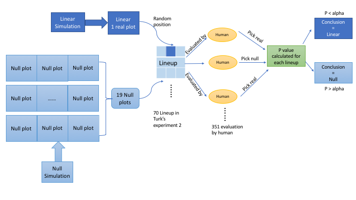
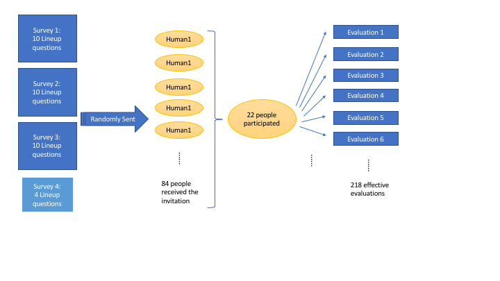
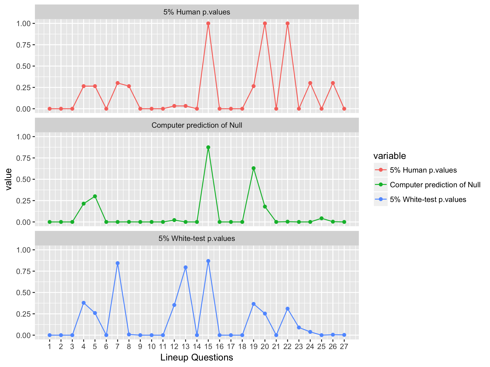

```{r setup, include=FALSE}
knitr::opts_chunk$set(echo = FALSE, message=FALSE, warning=FALSE, cache=TRUE, dev.args=list(bg=grey(0.9), pointsize=11))
```

## Reminder of the first presentation
### Our goal
**Teach the computer to read residual plots**

A major component used to diagnose model fits is a plot of the residuals. Residual plots are used to assess:

- Gauss-Markov assumption
- Heteroskedasticity
- Clumps of outliers 
- ...

## Why plots? 

```{r saurus, fig.height=2, fig.width=3.5, fig.align="center"}
library(tidyverse)
library(datasauRus)
ggplot(datasaurus_dozen, aes(x = x, y = y, colour = dataset)) +
  geom_point(size=0.5, alpha=0.5) +
  theme_void() +
  theme(legend.position = "none") +
  #theme(aspect.ratio = 1) +
  facet_wrap( ~ dataset, ncol = 5)
```
$E(x)=54.3, E(y)= 47.8, sd(x) = 16.8, sd(y) = 26.9, r = -0.06$

## Visual inference

```{r visinf}
library(nullabor)
library(broom)
set.seed(0414)
x <- runif(100, -1, 1)
df <- tibble(x, y=2+3*x+x^2-0.5*x^3+rnorm(100)*0.3)
df_lm <- lm(y~x, data=df)
df_mod <- augment(df_lm, df)
ggplot(lineup(null_permute(".std.resid"), df_mod), aes(x=x, y=.std.resid)) + geom_point() + facet_wrap(~.sample)
```

## Convolutional neural network (convnets)

- Computer vision has advanced substantially
- If we can train a computer to read residual plots we can have it process a lot more data, than a human can manage.

## Aside: Computers can't tell difference between blueberry muffins and chihuahuas 

```{r chihuahuas, fig.align='center', fig.retina=NULL, out.width='100%', echo=FALSE}
knitr::include_graphics("figures/choc_chip_muffins.png")
```

## Our Experiments

- First experiment: Linear vs. Null

$H_0$: There are no relationships between the two variables. (Null)

$H_1$: There is linear relationship between the two variables where all Gauss-Markov assumptions are met. (Linear)

- Second experiment: Heteroskedasticity vs. Homoskedasticity

$H_0$: There is linear relationship between the two variables where all Gauss-Markov assumptions are met. (Null)

$H_1$: There is linear relationship between the two variables where the variance of the error term is not a constant while all other Gauss-Markov assumptions are met. (Heteroskedasticity)


## First Experiment: Linear vs. Null
### Amazon Mechanical Turk study

- Majumder et al (2013) conducted a large study to compare the performance of the lineup protocol, assessed by human evaluators, in comaprison to the classical test
- Experiment 2 examined $H_o: \beta_k=0$ vs $H_a: \beta_k\neq 0$ assessing the importance of including variable $k$ in the linear model, conducted with a $t$-test, and also lineup protocol
- 70 lineups of size 20 plots
- 351 evaluations by human subjects
-
- Trained deep learning model will be used to classify plots from this study. Accuracy will be compared with results by human subjects.

## Frist Experiment: Linear vs. Null
### Example lineup from Turk experiment 2  
<!--display-->
```{r turkexp, fig.align='center', fig.height=4, fig.retina=NULL, out.width='80%', echo=FALSE}

```

## First Experiment: Linear vs. Null
### Human experiment procedures (diagram)



## First experiment: Linear vs. Null
### Computer model procedures (diagram)

```{r diagpc, fig.align='center',  fig.retina=NULL, out.width='100%', echo=FALSE}

```

## First experiment: Linear vs. Null
### Computer model procedures

1. Simulate data (X, Y) from the null and the alternative models
2. Generate scatter plots of X and Y
3. Save scatter plots as $150\times150$ pixels images
4. Train a deep learning classifier to recognise the patterns from two groups
5. Test the model's performance on new data and compute the accuracy

## First Experiment: Linear vs. Null
### Data simulation {#sec:simulation}  

The linear model:

$$Y_i = \beta_0 + \beta_1 X_{i}  + \varepsilon_i, ~~i=1, \dots , n$$

- $X \sim N[0,\ 1]$  

- $\beta_0 = 0$  

- $\beta_1\sim U[-10, -0.1] \bigcup [0.1, 10]$  

- $\varepsilon\sim N(0, \sigma^2) \ where\ \sigma \sim U[1,12]$  

- $n=U[50,500]$  

The null model:

- $\beta_1=0$

## First Experiment: Linear vs. Null
### Histogram of simulated parameters from linear model


## First Experiment: Linear vs. Null
### Histogram of simulated parameters from null model

```{r histnull, fig.align='center', fig.retina=NULL, out.width='60%', echo=FALSE}

```

## First Experiment: Linear vs. Null
### Convnets R code

```{r modelstructure, echo=TRUE, tidy=TRUE, size=12, message=FALSE, warning=FALSE, results='none'}
library(keras)
model <- keras_model_sequential() %>%
  layer_conv_2d(filters = 32, kernel_size = c(3, 3), 
                activation = "relu",
                input_shape = c(150, 150, 1)) %>%
  layer_max_pooling_2d(pool_size = c(2, 2)) %>%
  layer_conv_2d(filters = 64, kernel_size = c(3, 3), 
                activation = "relu") %>%
  layer_max_pooling_2d(pool_size = c(2, 2)) %>%
  layer_conv_2d(filters = 128, kernel_size = c(3, 3), 
                activation = "relu") %>%
  layer_max_pooling_2d(pool_size = c(2, 2)) %>%
  layer_flatten() %>%
  layer_dense(units = 512, activation = "relu") %>%
  layer_dense(units = 1, activation = "sigmoid")
```

## First Experiment: Linear vs. Null
### Convnets structure


## How convnets works: Diagram of convolution and max pooling

```{r diagconv, fig.height=4, fig.retina=NULL, out.width='80%', echo=FALSE}

```

## First Experiment: Linear vs. Null
### Training and validation metrics of convnets

```{r metrics1, fig.align='center', fig.retina=NULL, out.width='70%', echo=FALSE}
knitr::include_graphics("figures/linear_history_plot.png")
```


## First Experiment: Linear vs. Null
### Convnets model selection

The 8th model is chosen according to the overall accuracy on the test set.

\begin{table}[ht]
\begin{center}
\begin{tabular}{|l|rrr|}\hline
Tests & Linear & Null & Overall \\\hline
4 epoch & 0.892 & 0.984 &  0.938 \\   
6 epoch & 0.889 & 0.986 & 0.937 \\
8 epoch & 0.896 & 0.981 & 0.939 \\
10 epoch & 0.904 & 0.971 & 0.938 \\
5\% $t$-test & 0.921 & 0.949 & 0.935\\\hline
\end{tabular}
\end{center}
\caption{Performance of four checkpoints from the {\em convnets} model, and the 5\% significant $t$-test, computed on the test set. Accuracy is reported for each class, and overall.}
\label{checkpoints}
\end{table}


## First Experiment: Linear vs. Null
### Computer model performance calculation 

The performance of the computer model for the Turk study data is tested in three steps:

- Re-generate the 70 "real plots" using the same data in Turk study (without null plots);

- Create a seperate test directory for the 70 "real plots" exclusively;

- The computer model's predicted accuracy over the 70 "real plots" are recorded as the model's performance.

## First Experiment: Linear vs. Null
### Human evaluation performance calculation 

The conclusion of human evaluation is obtained differently from the computer's. Because human evaluated "lineup", not only the "real plots". The performance is tested in five steps:

- Count total number of evaluations made by human for one lineup (N) and the number of correct answers for that lineup (k);

- Obtain N and k for all 70 lineup;

- Calculate p-value associated with each real plot using the formula introduced in section 2 of Majumder et al (2013);

- Draw conclusion: reject the null when the calculated p-value is smaller than $\alpha$.

- The accuracy of the conclusions the 70 real plots is presenting for the human performance.

## First Experiment: Linear vs. Null
### Comparing results

```{r linearresults, echo=F, results='asis'}
library(knitr)
tests <- c("Human 5%", "Human 2%", "T-test 5%", "Computer 2%", "T-test 2%")
rank <- c(1,1,2,3,4)
correct <- c(47, 47, 43, 39, 39)
accuracy <- c(0.6714,0.6714, 0.6143, 0.5571, 0.5571)
tibble(rank, tests, correct, accuracy) %>% kable(col.names = c("Rank","Tests", "No. of correct", "Accuracy"), caption = "Accuracy of testing the 70 data plots evaluated by human computer and the conventional t-test.")
```

## First Experiment: Linear vs. Null
### Aside discussion

It is possible that the best classification strategy found by convnets is in fact the convetional t-test.

```{r ttdl, fig.align='center', fig.retina=NULL, out.width='80%', echo=FALSE}
knitr::include_graphics("figures/ttest_dl_graph.png")
```

## Second Experiment: Heter vs. Homo
### Human experiment setup
 
```{r heterexpdiag, fig.align='center', fig.cap="Human subjects experiment setup", fig.retina=NULL, out.width='100%', echo=FALSE}

```

## Second Experiment: Heter vs. Homo
### An example of questions used in the human experiment 

```{r heterlineup, fig.align='center', fig.height=4,  fig.retina=NULL, out.width='80%', echo=FALSE}

```

## Second Experiment: Heter vs. Homo
### Heteroskedasticity simulation

The Heteroskedasticity model:

$$Y_i = \beta_0 + \beta_1 X_{i}  + \varepsilon_i, ~~i=1, \dots , n$$

- $X\sim U[-1,\ 1]$

- $\beta_0 = 0$

- $\beta_1\sim U[0.5,\ 1]$

- $\varepsilon\sim N(0,\ (aX+v)^2)$

- $a\sim U(-5,\ -0.05)\bigcup(0.05,\ 5)$

- $v \sim N(0,\ 1)$

- $ax+v-min(ax+v)$ when $min(ax+v)<0$ 

- $n\sim U[50,\ 500]$ 

The null model:

- $\varepsilon\sim N(0,\ c)$

- $c=mean(ax+v)$


## Second Experiment: Heter vs. Homo
### White test

To provide a reference level of how computer and human perform, a special case of White test is used in this experiment. The procedure of the White test [@IE17] is:

- Estimate OLS model for the data, obtain residuals ($\hat{u}$) and the fitted values ($\hat{y}$). Computer the squared OLS residuals ($\hat{u}^2$) and the squared fitted values ($\hat{y}^2$).

- Run an auxiliary regression as $\hat{u}^2=\eta_0+\eta_1  \hat{y}+\eta_2 \hat{y}^2+error$, obtain the R-squared $R_{\hat{u}^2}^2$

- Calculate the LM statistic which follows $\chi_2^2$ distribution

- Conclude based on p-values given certain $\alpha$

## Second Experiment: Heter vs. Homo
### Training and validation metrics of convnets

```{r metrics2, fig.align='center', fig.height=4,  fig.retina=NULL, out.width='80%', echo=FALSE}

```

## Second Experiment: Heter vs. Homo
### Convnets model selection

The performance of models from different epoch are very similar. The 11th is selected according to overall accuracy.

```{r heterselect, echo=F, paged.print=FALSE, results='asis'}
Tests <- c("4 epoch", "11 epoch", "15 epoch","5% White test")
Heter <- c("0.970","0.963","0.959","0.856")
Homo <- c("0.967", "0.984","0.984", "0.952")
Overall <- c("0.968", "0.974", "0.972","0.904")
tibble(Tests, Heter, Homo, Overall) %>% kable(caption = "Performance of three checkpoints from the convnets model, and the 5% significant white-test, computed on the test set. Accuracy is reported for each class, and overall.")
```

## Second Experiment: Heter vs. Homo
### Human performance in the experiment

```{r hheter, fig.align='center', fig.height=4,  fig.retina=NULL, out.width='80%', echo=FALSE}

```

## Second Experiment: Heter vs. Homo
### Comparing results

```{r heteresults, echo=F, paged.print=FALSE, results='asis'}
tests <- c("Computer 2%", "Human 5%", "White-test 5%", "White-test 2%", "Human 2%")
rank <- c(1,2,2,3,4)
correct <- c(25, 17, 17, 16, 15)
accuracy <- c("92.59%","62.96%", "62.96%","59.26%","55.56%")
tibble(rank, tests, correct, accuracy) %>% kable(col.names = c("Rank","Tests", "No. of correct", "Accuracy"), caption = "Accuracy of testing the 27 data plots evaluated by human computer and the conventional white-test.")
```

## Second Experiment: Heter vs. Homo
### Comparing results -- p.values

```{r heterp, fig.align='center', fig.height=4, fig.retina=NULL, out.width='80%', echo=FALSE}

```


## Materials

- The thesis, code and data is available on the github repository [https://github.com/shuofan18/ETF5550](https://github.com/shuofan18/ETF5550)
- Software used to conduct this research is R, Tensorflow, keras, tidyverse
